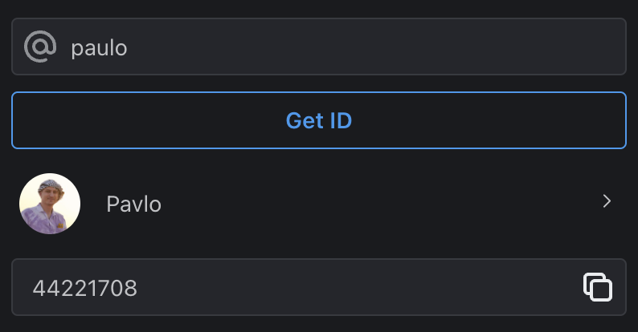
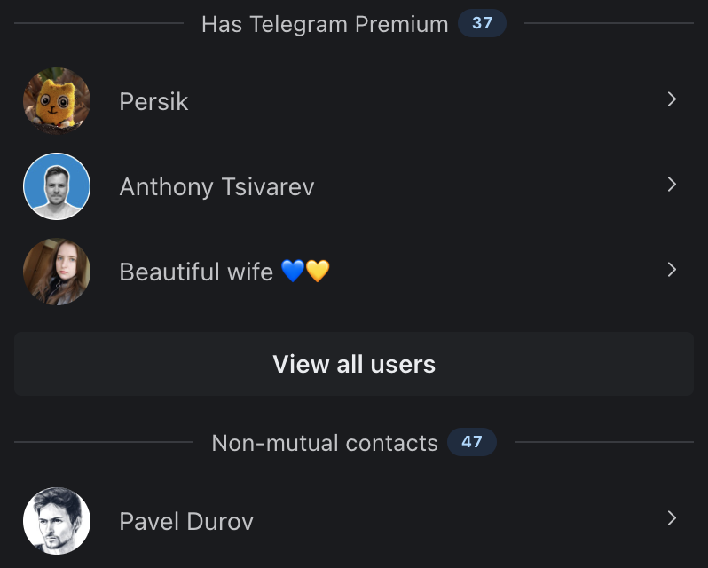
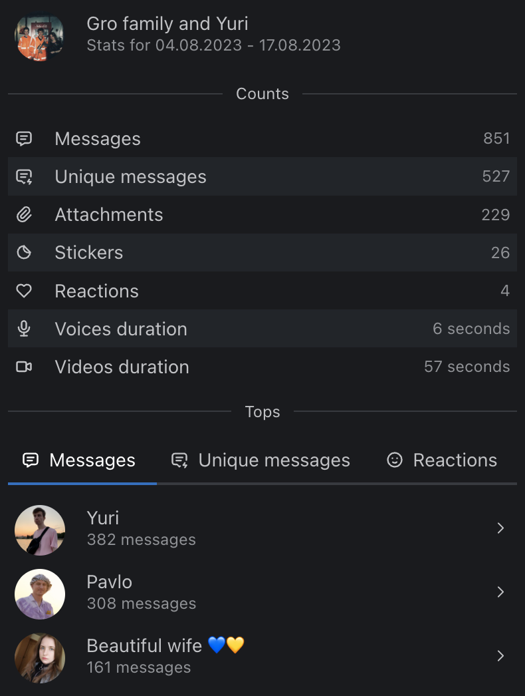
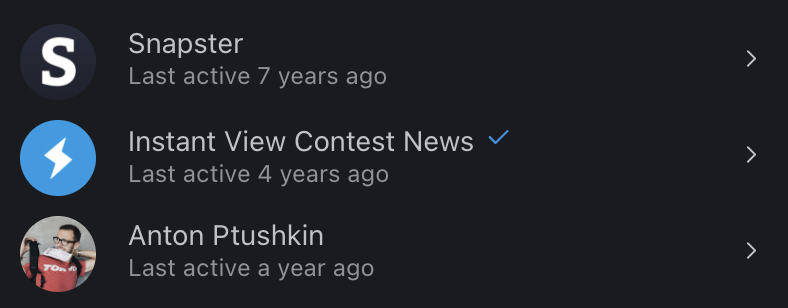

# Methods

1. [Get account or channel ID](METHODS.md#get-account-or-channel-id)
2. [Contact analysis](METHODS.md#contact-analysis)
3. [Messages stat](METHODS.md#messages-stat)
4. [Animated messages](METHODS.md#animated-messages)
5. [Inactive channels and supergroups](METHODS.md#inactive-channels-and-supergroups)

## Get account or channel ID
The method gets the digital ID of the user/channel/chat by short name.

## Contact analysis
The method scans your contacts and shows the results in several blocks:
* Has Telegram Premium
* Registered among the first 100 million users
* Mutual contacts
* Non-mutual contacts
* Without photo
* Verified
* Has several usernames
* Unknown phone number
* Without username
* Deleted
* Last seen a long time ago
* Hidden online
* By last seen

## Messages stat
The method scans the selected dialog and returns some statistics for the selected period.

Shows total counts and tops by category:
* Total messages
* Unique messages
* Reactions
* Attachments
* Stickers
* Voices duration
* Videos duration
* Calls duration

## Animated messages
The method sends a message, then through editing makes a beautiful animation.

https://github.com/gromadchuk/kit-42/assets/3388163/45511f02-ade2-450a-af38-3bec76b642b5

## Inactive channels and supergroups
The method shows channels and supergroups that have not been active for a long time.

